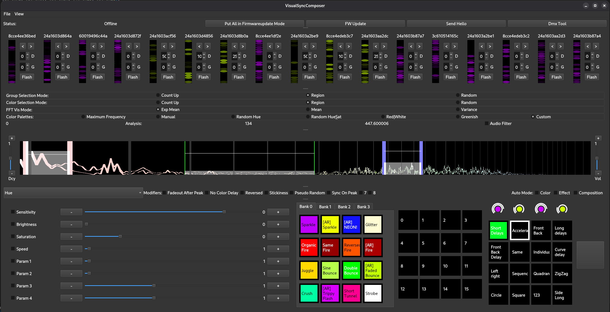

# Visual Sync Composer

This software implements a vision of a flexible, low-latency protocol for controlling ESP8266 controlled adressable LED Strips.
The software sends out raw wifi frames (you need a monitor mode wifi card) to configure the clients and to trigger effects.
The idea is to have low-cost hardware and an intelligent software to create (de-)synchronized, audioreactive effect shows on many different fixtures.
in the current state it already seems as if the individual tubes have a signalling wire instead of beeing wireless :)

Code for LED Tubes and support for different lights (DMX, etc.) will follow.

# BUILDING:

See [BUILDING.md](BUILDING.md)
